# Enterprise CRM - System Design Diagrams

## 🏗️ System Architecture Overview

This document provides visual representations of the Enterprise CRM system architecture, component relationships, and data flow patterns.

## 📊 High-Level System Architecture

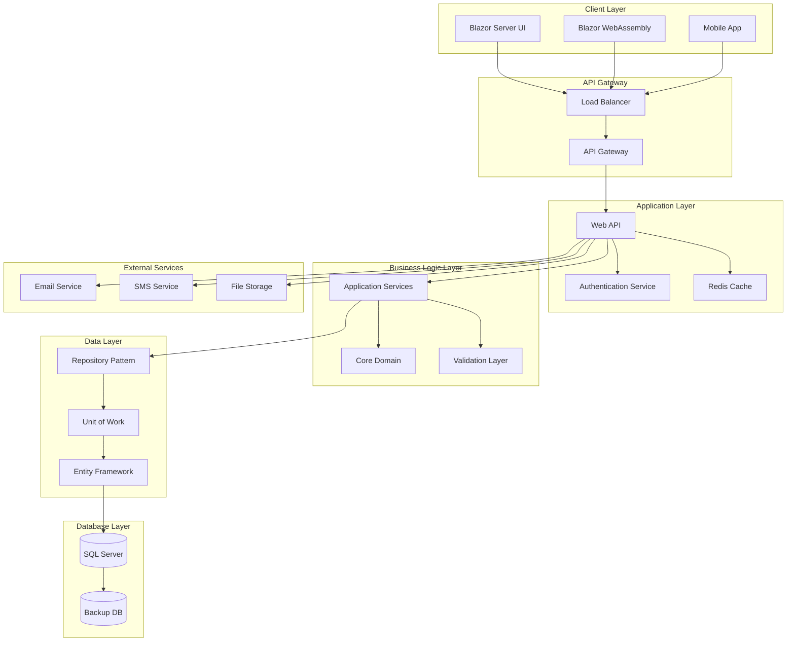

## 🔄 Clean Architecture Layers

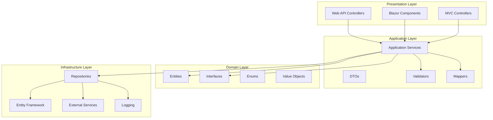

## 🗄️ Database Entity Relationship Diagram

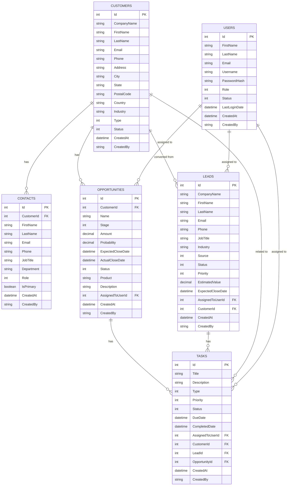

## 🔄 Data Flow Architecture

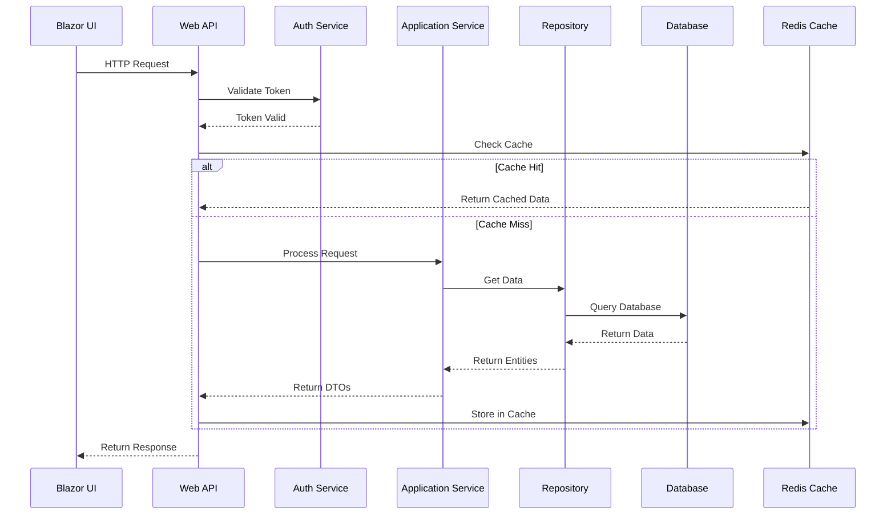

## 🚀 Deployment Architecture

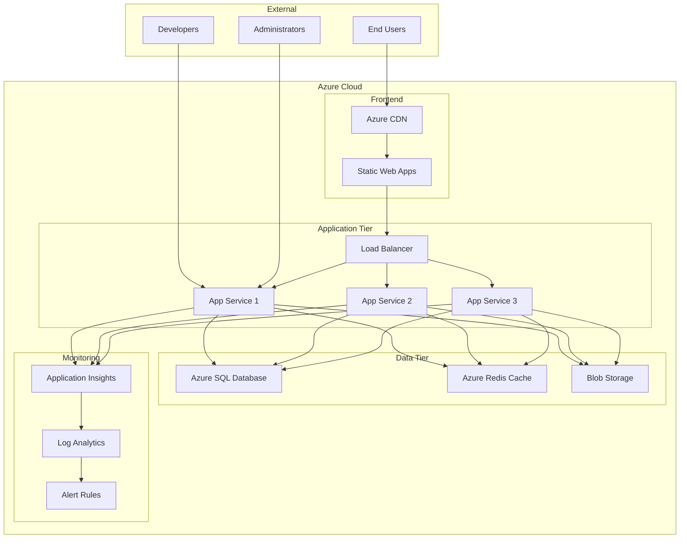

## 🔐 Security Architecture

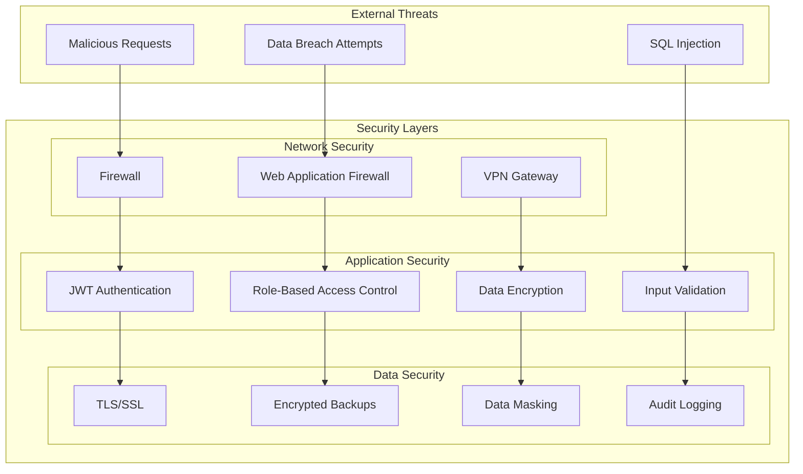

## 📊 Microservices Architecture (Future)

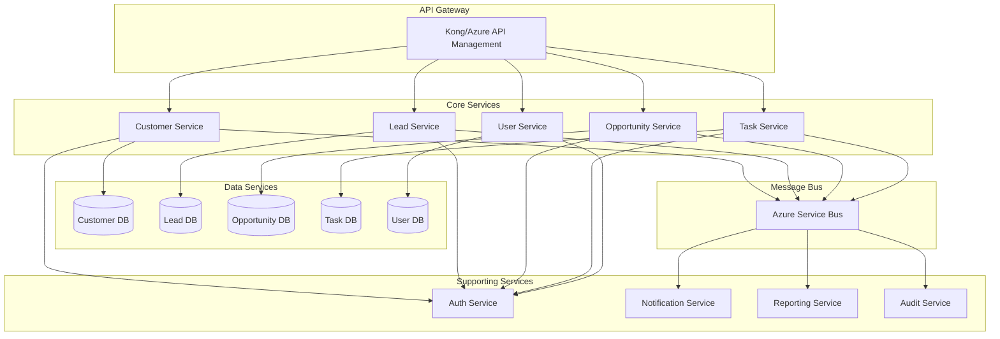

## 🔄 CQRS Pattern Implementation

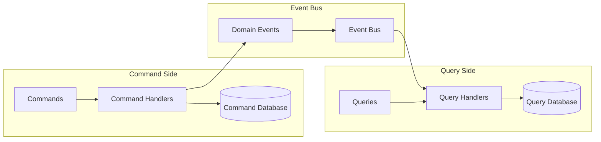

## 📈 Performance Architecture

```mermaid
graph TD
    subgraph "Caching Strategy"
        L1[L1 Cache - In-Memory]
        L2[L2 Cache - Redis]
        L3[L3 Cache - CDN]
    end
    
    subgraph "Database Optimization"
        INDEX[Database Indexes]
        PART[Table Partitioning]
        REPLICA[Read Replicas]
    end
    
    subgraph "Application Optimization"
        POOL[Connection Pooling]
        ASYNC[Async/Await]
        COMPRESS[Response Compression]
    end
    
    subgraph "Monitoring"
        METRICS[Performance Metrics]
        PROFILER[Application Profiler]
        ALERTS[Performance Alerts]
    end
    
    L1 --> L2
    L2 --> L3
    INDEX --> PART
    PART --> REPLICA
    POOL --> ASYNC
    ASYNC --> COMPRESS
    METRICS --> PROFILER
    PROFILER --> ALERTS
```

## 🧪 Testing Architecture

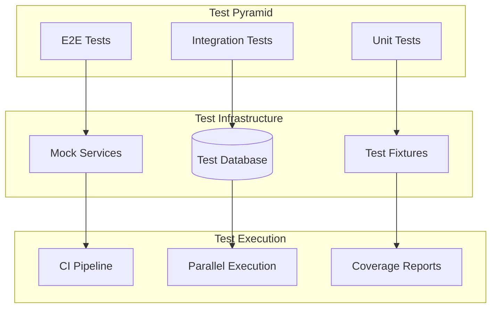

## 🔧 DevOps Pipeline Architecture

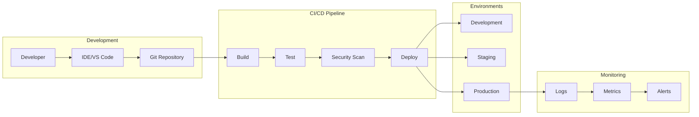

## 📋 Diagram Usage Guidelines

### **When to Use Each Diagram:**

- **High-Level Architecture:** Stakeholder presentations, system overview
- **Clean Architecture:** Developer onboarding, architectural decisions
- **Database ERD:** Database design, data modeling discussions
- **Data Flow:** Understanding request/response patterns
- **Deployment:** Infrastructure planning, DevOps discussions
- **Security:** Security reviews, compliance documentation
- **Microservices:** Future architecture planning
- **CQRS:** Advanced pattern implementation
- **Performance:** Optimization planning, bottleneck identification
- **Testing:** Test strategy, quality assurance planning
- **DevOps:** CI/CD pipeline design, automation planning

### **Tools for Creating Diagrams:**

- **Mermaid:** Used in this document (GitHub native support)
- **Draw.io:** Free online diagramming tool
- **Lucidchart:** Professional diagramming platform
- **Visio:** Microsoft's diagramming tool
- **PlantUML:** Text-based diagram generation

### **Best Practices:**

- **Keep diagrams simple** and focused on specific concerns
- **Use consistent notation** across all diagrams
- **Update diagrams** when architecture changes
- **Include legends** for complex diagrams
- **Version control** diagram source files

This comprehensive set of system design diagrams provides visual documentation for all aspects of the Enterprise CRM system architecture, from high-level overview to detailed implementation patterns.
